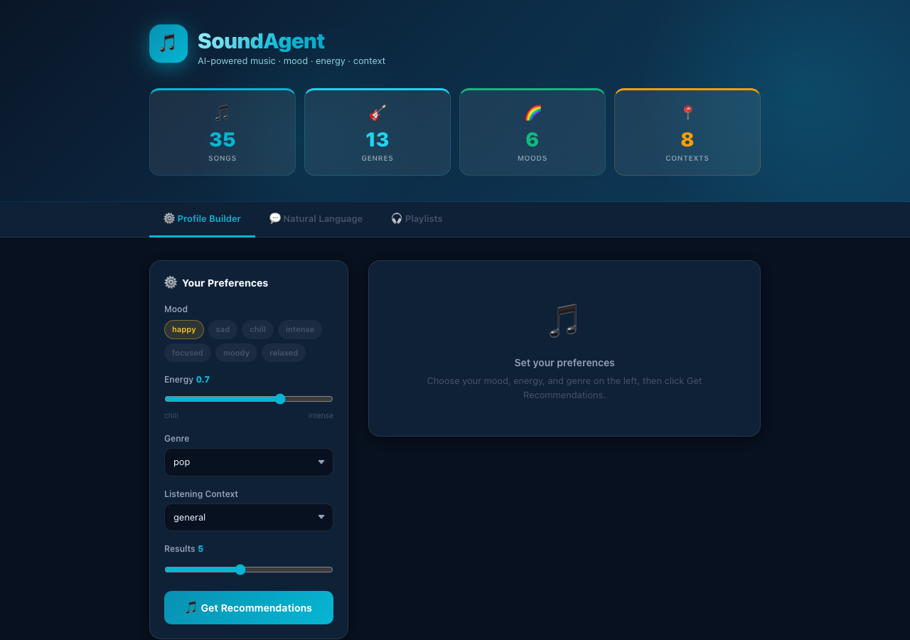
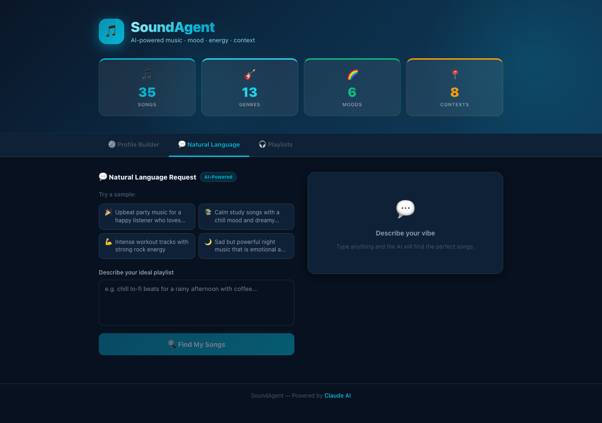
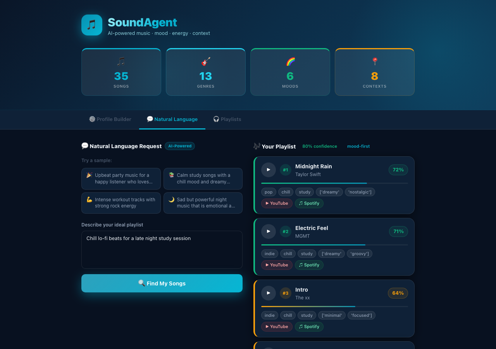
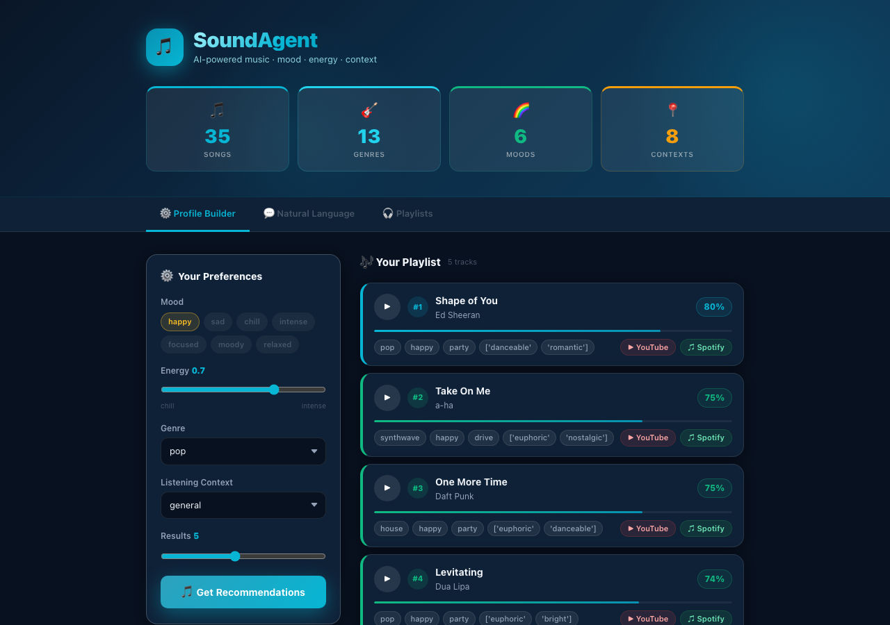
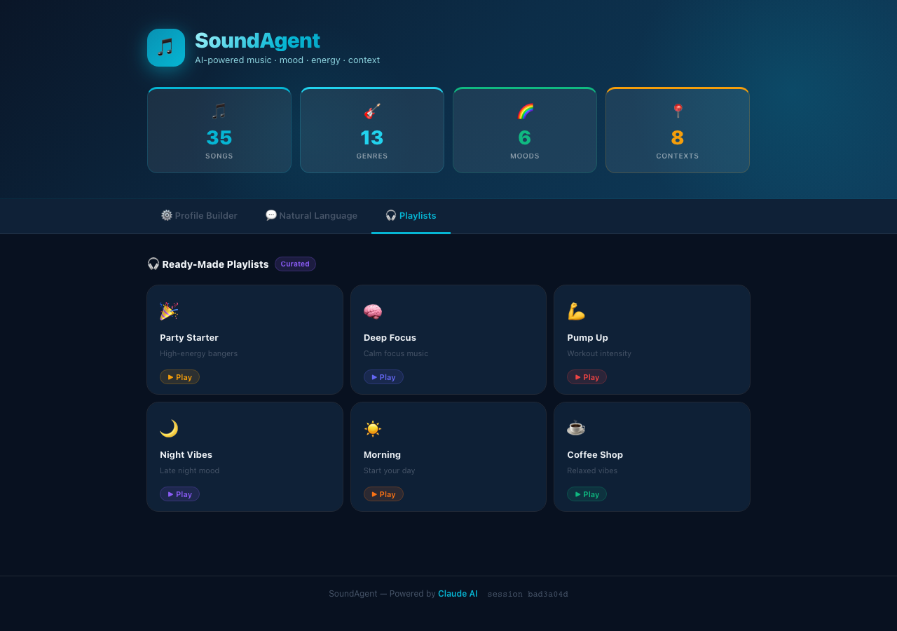
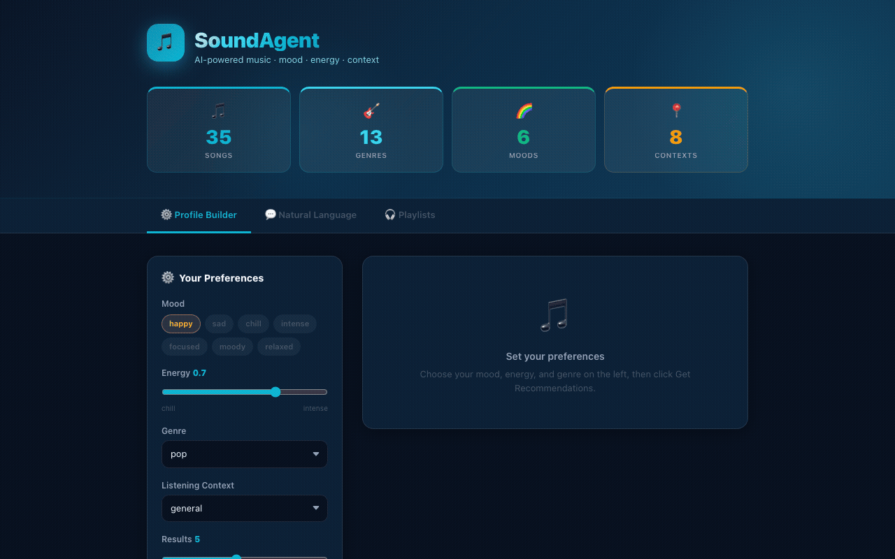
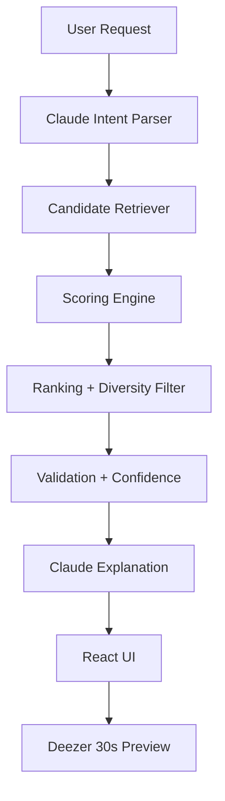

# 🎵 SoundAgent

### An Agentic AI Music Recommender powered by Claude

> Built for the **AI Agents Hackathon**.

---

## What It Does

SoundAgent is an AI-powered music recommendation assistant with a modern React web UI. Describe what you want to hear — a mood, a vibe, a moment — and it builds you a playlist, with in-app 30-second audio previews via Deezer.

- Natural language input parsed by **Claude** into structured preferences
- Songs retrieved from a curated catalog and scored with multi-step reasoning
- Confidence scoring and guardrails to validate results
- In-app **30-second audio previews** with play/pause and seek
- Quick links to **YouTube** and **Spotify** for every track
- Ready-made curated playlists for common moods

---

## App Preview

**Home — Stats & Profile Builder**


**Natural Language Request — AI-Powered**


**NL Results with Confidence Score**


**Profile Builder Results — Ranked Songs with Match Scores**


**Ready-Made Playlists**


---

## Video Walkthrough



> Covers: home dashboard, natural language AI input, confidence scoring, ready-made playlists, and profile-based recommendations.

---

## Architecture



| Component | File | Role |
|---|---|---|
| Claude Intent Parser | `src/claude_client.py`, `src/system.py` | Parses natural language into mood, energy, genre, context |
| Retriever | `src/system.py` | Selects candidates via metadata + keyword matching |
| Recommender | `src/recommender.py` | Weighted scoring, diversity penalty, ranking |
| FastAPI Backend | `api/main.py` | REST API + Deezer preview proxy + session memory |
| React Frontend | `frontend/src/` | Vite + Tailwind UI with animations and audio playback |

---

## Key Features

- **Claude API — Structured Mood Parsing** — natural language like *"I'm feeling nostalgic and melancholic tonight"* is sent to Claude with a Pydantic JSON schema; returns validated structured preferences. Falls back to keyword matching without an API key.
- **Claude API — Streaming Explanation** — after ranking, Claude streams a warm explanation of why the playlist fits.
- **In-App Audio Previews** — 30-second Deezer previews play directly in the card; album art loads automatically.
- **RAG** — retrieves song documents and custom genre notes from `data/genre_notes.csv` before scoring.
- **Agentic Workflow** — parse → retrieve → score → rank → validate → explain.
- **Session Memory** — recommendations build on prior context within a session.
- **Listening Profiles** — tuned weights for study, party, workout, relax, and night.

---

## Project Structure

```
api/
  main.py            — FastAPI backend (recommendations + Deezer preview proxy)
frontend/
  src/
    App.jsx          — main layout, hero, tab navigation
    components/      — SongCard, ProfileTab, NLTab, PlaylistsTab
    index.css        — design system (CSS variables, animations)
src/
  claude_client.py   — Claude API integration (mood parsing + explanation)
  recommender.py     — scoring, ranking, diversity penalty
  system.py          — agentic pipeline: parse, retrieve, validate, confidence
  evaluator.py       — reliability harness
app.py               — Streamlit fallback UI
data/songs.csv       — song catalog
data/genre_notes.csv — external genre notes for RAG
```

---

## Setup

```bash
pip install -r requirements.txt
export ANTHROPIC_API_KEY=your_key_here
```

**Run the API:**
```bash
uvicorn api.main:app --reload
```

**Run the frontend:**
```bash
cd frontend && npm install && npm run dev
```

Open [http://localhost:5173](http://localhost:5173)

> Without an API key the app still works — it falls back to keyword-based parsing and skips the AI explanation.

**Run tests:**
```bash
python3 -m pytest -q
```

---

## Links

- GitHub: https://github.com/kneha07/SoundAgent-Agentic-AI-Music-Recommender-

---

## What's Next

- Richer catalog with more metadata coverage
- Conversational feedback loop so Claude can ask clarifying questions
- Embedding-based retriever for semantic matching
- Claude tool use to let the agent query the catalog dynamically
